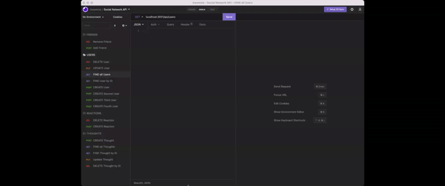
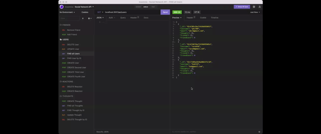
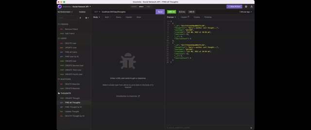
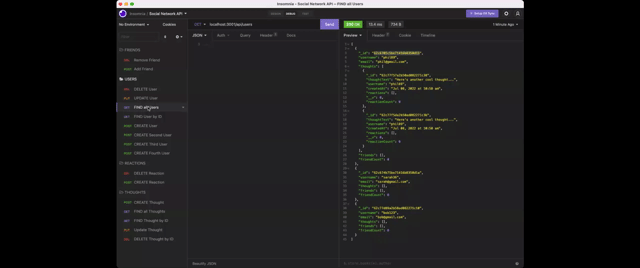

# NoSQL: Social Network API (sjb-social-network-api)

## Description

MongoDB is a popular choice for many social networks due to its speed with large amounts of data and flexibility with unstructured data.

This social network API was developed using Express.js for routing, a MongoDB database, and the Mongoose OD. Users can share their thoughts, react to friends’ thoughts, and create a friend list.

## User Story

```md
AS A social media startup
I WANT an API for my social network that uses a NoSQL database
SO THAT my website can handle large amounts of unstructured data
```

## Preview

###### Example of GET routes for all users, all thoughts, single user and a single thought



###### Example of POST, PUT, and DELETE routes for users and thoughts


###### Example of POST and DELETE routes for a user’s friend



###### Example of POST and DELETE routes for reactions to thoughts



###### Example of DELETE user and associated thoughts



More demo's in the [Walkthrough videos](#walkthrough-video-links)

## Installation

###### Local Installation

- Clone the repository from [Github](git@github.com:simmmmo/sjb-social-network-api.git)
- Ensure Node.js is installed
- Ensure the Insomnia app is installed
- Install dependencies
  [express package](https://www.npmjs.com/package/express)

```bash
npm install
```

- Ensure all additional packages have been installed

- Start the server

```bash
npm start
```

- Open Insomnia App to test API routes

## Usage

###### Walkthrough video links

Start the application’s server

https://drive.google.com/file/d/1RCc2KrYYgE7UFWWY3ZpXP2OVK8KDMiVI/view

GET routes for all users and all thoughts, routes for a single user and a single thought being tested in Insomnia.

https://drive.google.com/file/d/1bvQ-qEG4YeENyddGzYR8zlyOI_-CVVtb/view

POST, PUT, and DELETE routes for users and thoughts being tested in Insomnia.

https://drive.google.com/file/d/1c31qXNg-ggfbtF2ta5sXXFFY6m_8TH_q/view

POST and DELETE routes for a user’s friend being tested in Insomnia.

https://drive.google.com/file/d/1e0xnDof5n5r9qkH4WhUJK-BJ1tQO0X3j/view

POST and DELETE routes for reactions to thoughts being tested in Insomnia.

https://drive.google.com/file/d/1PKnZ4A6O_aGzvLjpWX28GU2S0-WxdHzW/view

_BONUS_ DELETE a user's associated thoughts when the user is deleted being tested in Insomnia.

https://drive.google.com/file/d/1vpJz2RsviN1itgP7zIaSHD2Bon14oeoz/view

## Technology

- Node.js
- Express.js
- MongoDB
- Mongoose
- Moment

## Project Links

###### Repo name

- sjb-social-network-api

###### GitHub enviroment

- https://github.com/simmmmo/sjb-social-network-api
- git@github.com:simmmmo/sjb-social-network-api.git
